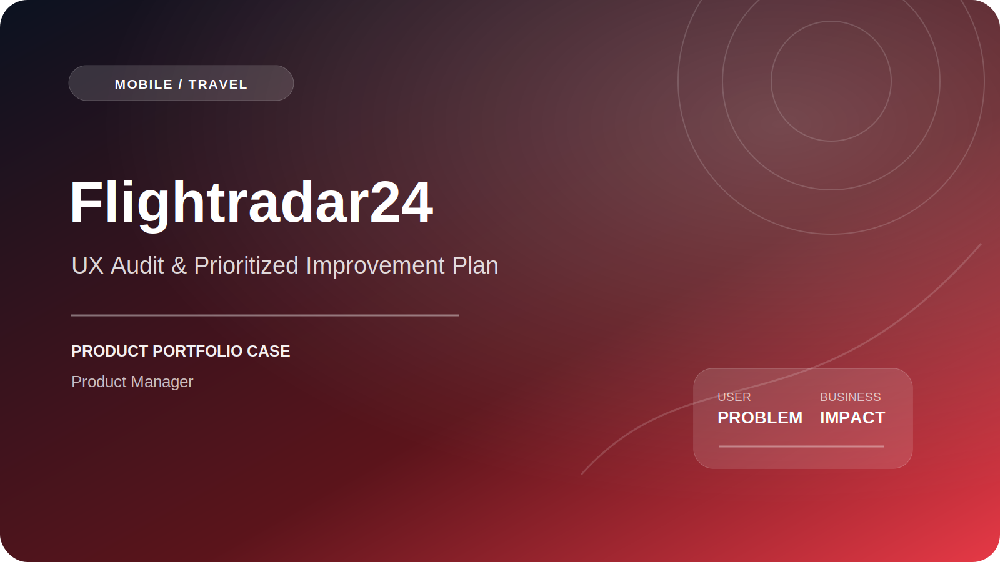

# Flightradar24 — UX Audit & Prioritized Improvement Plan

   

**Систематизация более 50 UX-проблем и перевод наблюдений в приоритизированный план продуктовых улучшений.**

[Web](https://www.flightradar24.com/) · [Apps](https://www.flightradar24.com/apps)

## Контекст продукта

Flightradar24 — web- и mobile-продукт для отслеживания рейсов: карта, поиск, карточка рейса, аэропорты, самолёты, фильтры, история и расширенные режимы.

## Проблема пользователя и бизнеса

- высокая плотность объектов на карте;
- несколько способов найти один рейс;
- сложная информационная иерархия карточки;
- потеря фильтров, масштаба или выбранного рейса при возврате;
- неочевидная ценность части функций до paywall.

## Моя роль

1. Анализировал пользовательские сценарии и UX-замечания.
2. Систематизировал более 50 проблем и точек трения.
3. Группировал проблемы по этапам journey и типам риска.
4. Формулировал требования и Acceptance Criteria.
5. Приоритизировал изменения по impact, сложности и риску.
6. Координировал обсуждение решений с разработкой, дизайном и QA.
7. Проверял целостность сценариев перед релизом.

## Основной пользовательский путь

`Карта / поиск → Выбор рейса → Детали → Аэропорт / самолёт → Follow → Возврат`

## Продуктовый фокус

| Область | Проблема / риск | Решение или критерий качества |
|---|---|---|
| Карта | Случайный выбор объекта | Hit area и явный selection state |
| Поиск | Неясен допустимый формат | Подсказки, примеры и устойчивые empty states |
| Filters | Непонятно активное состояние | Явные chips и быстрый reset |
| Back navigation | Теряется контекст | Сохранение viewport, filters и selected flight |

## Результат и impact

Сформирован и приоритизирован план улучшений на основе **50+ UX-проблем** и пользовательских сценариев. Наблюдения были переведены в рабочий backlog с ожидаемым эффектом, рисками и критериями проверки.

## Metric framework

**North Star:** успешно отслеженные пользователями значимые рейсы.

**Воронка:**  
`App open → Search / Map interaction → Flight selected → Details viewed → Follow / Repeat use`

**Ключевые метрики:**

- search success rate;
- time to flight;
- map-to-flight conversion;
- follow activation;
- repeat tracking rate;
- notification engagement;
- trial conversion.

**Guardrails:**

- crash-free sessions;
- map loading time;
- wrong-flight selection;
- stale-data incidents;
- notification failure rate.

## Артефакты Product Manager

- UX issue inventory;
- user-flow map;
- prioritized backlog;
- User Stories и Acceptance Criteria;
- Impact / Effort matrix;
- metric framework;
- QA / regression scenarios.

## Ограничения публикации

Репозиторий является портфолио-кейсом. Он не содержит production-код, внутренние документы, доступы, персональные данные, коммерческую аналитику или материалы, защищённые NDA. Официальный продукт и торговые марки принадлежат их владельцам; моя зона ответственности ограничена описанным выше scope.

## Компетенции

`Product Management` · `UX Audit` · `Mobile` · `Maps` · `Search` · `Prioritization` · `Backlog Management` · `Acceptance Criteria` · `Product Metrics`
